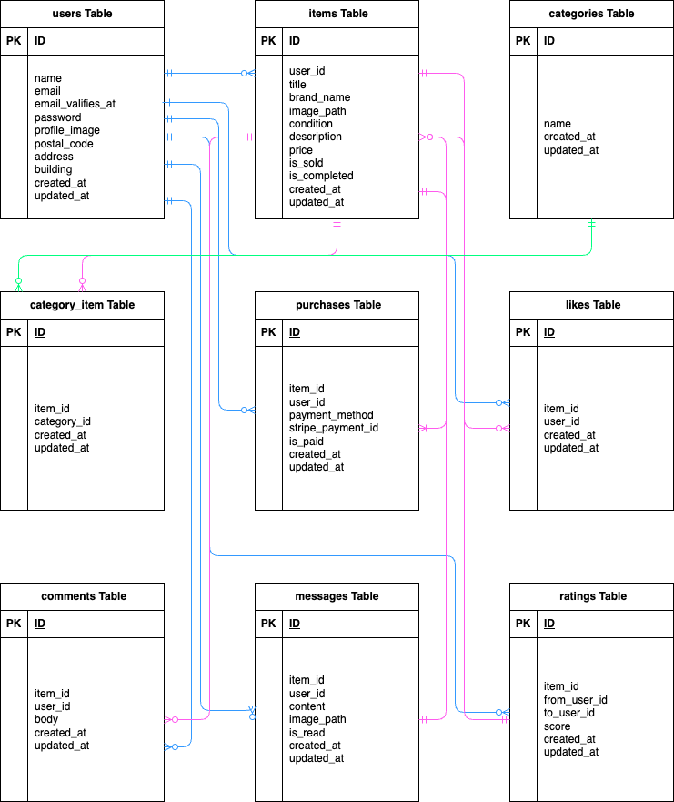

# 環境構築
## Dockerビルド
- git clone <https://github.com/chino-mako/flea-market2>
- docker-compose up -d --build

## Laravel 環境構築
- docker-compose exec php bash
- composer install
- cp .env.example .env
- php artisan key:generate
- php artisan migrate
- php artisan db:seed
- php artisan storage:link

# 使用技術
- PHP:7.3/8.0
- Laravel:8.75
- MySQL:8.0.26
- mailhog
- stripe

# URL
- 開発環境: http://localhost/
- phpMyAdmin: http://localhost:8080/

# ER図


# メール認証機能
- mailhogを使用してメールの送信・受信の動作確認を行なっています。

# Stripe決済機能

このフリマアプリでは、オンライン決済処理に **Stripe** を利用しています。  
ユーザーは商品購入時に安全にクレジットカード決済を行うことができます。

---

## 機能概要
- 出品された商品を購入する際、Stripeによるクレジットカード決済が可能です。
- 現在は **テストモード** で運用しており、実際の請求は発生しません。

---

## 開発者向けセットアップ
1. Stripeアカウント作成
[Stripe公式サイト](https://stripe.com/jp) にアクセスし、無料アカウントを作成してください。

2. ダッシュボード → 「開発者」 → 「APIキー」から以下を取得
 - 公開可能キー（pk_test_...）
 - シークレットキー（sk_test_...）
3. ```.env```に設定
```env
STRIPE_KEY=pk_test_***************
STRIPE_SECRET=sk_test_***************
```

## テスト用カード情報
Stripeが提供するテスト用カード番号です。
テストモードでは以下の番号を使用してください。

カード番号: 4242 4242 4242 4242	</br>
有効期限: 任意の未来日</br>
CVC: 任意	

# テストアカウント
## name: 田中　太郎</br> email:　tanaka@example.com</br> password: password123

## name: 佐藤　花子</br> email:　sato@example.com</br> password: password123

## name: 鈴木　一郎</br> email: suzuki@example.com</br> password: password123

